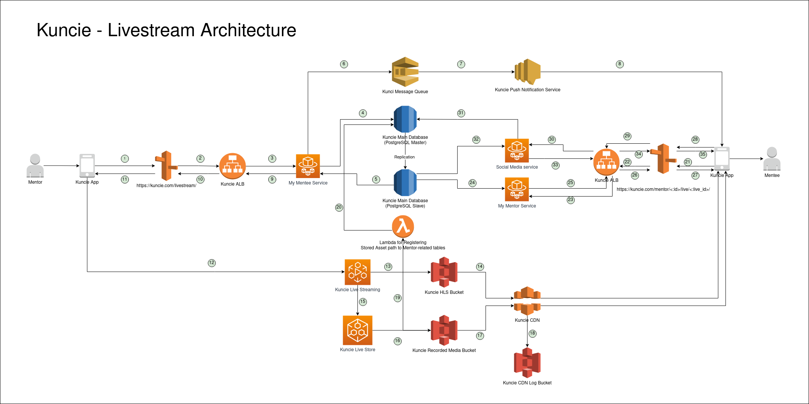
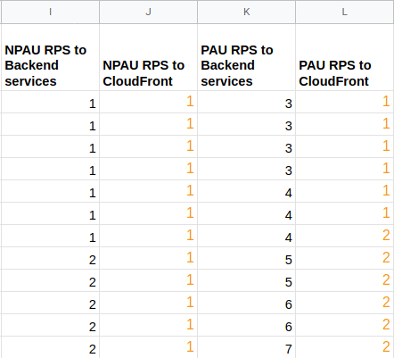
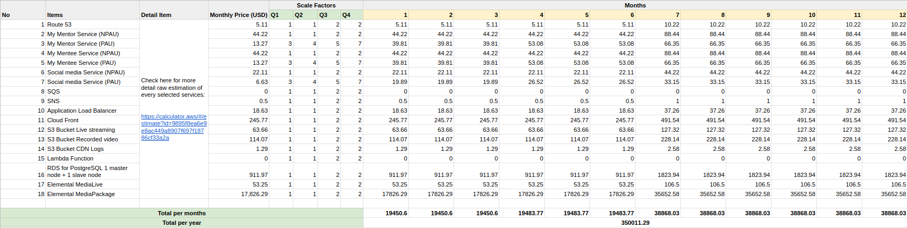

# Live Streaming App System Design

## A. Solution Architecture

## A.1.1 Proposed Architecture

After performed some researches on AWS documentation and blog about live streaming app use cases. I made this architecture to define a resilient and reliable live streaming system.

Based on the architecture above, AWS services that might involve in building live streaming system are:

- Route53, storing DNS record
- Application Load Balancer (ALB), I expect to use zonal load balancer. So the backend application services might distributed in different zone in Singapore region
- Fargate, I expect to use Fargate since it's the easiest way to manage containerized service. But unfortunately, it's stil only available for Singapore region
- Simple Queue Service (SQS), this service will be used to process tasks that should be performed exactly once such as sending push notification to client
- Simple Notification Service (SNS), this service will be used to announce the mentee about the live streaming schedule from their mentors
- Relational Database Service (RDS) for PostgreSQL, this service will be act as a primary datastore for live streaming app and other services related into live streaming business processes
- MediaLive, this service will let mentors to perform live streaming to their mentees
- MediaPackage, this service will record live streaming session for mentees if the want to watch again the session
- Simple Storage Service (S3), this service will store live streaming files and recorderd video for mentees
- Lambda, this service will store S3 path to particular session datapoint in RDS for PostgreSQL
- CloudFront, this ervice will help MediaLive to perform live streaming and play recorded video to my mentees with high availability

Some services might might be go public but with strict measurement are:

- CloudFront
- S3 Buckets
- Application Load Balancer with public IP address
- MediaLive

I assume these services are located inside private network. So it should be secure enough and prevent unwanted access from outside.

- Fargate
- SQS
- SNS
- RDS
- MediaPackage
- Lambda Function

Furthermore, I choose those services above because AWS have all of required services to build live streaming solution and easily manage in single place. Moreover, I couldn't find similar solution such as MediaLive and MediaPackage from another services or cloud providers.

Now, let me explain  more about the architecture and proposed AWS services by following the step by step number on the diagram above:

1. Mentor by using the mobile app will ask Route53 to perform the live streaming by accessing the domain name and required endpoint. I assume the endpoint name is `/livestream/`
2. Route53 will let the request going through ALB 
3. ALB select `My Mentee Service` in different region with `round-robin like balancing`
4. `My Mentee Service` create new live streaming session and store related datapoints in PostgreSQL master node on top of RDS
5. `My Mentee Service` fetch related information from PostgreSQL slave node. This information will be transformed into payload. The payload might contain live streaming session created by mentor and list of mentees
6. We must ensure if every mentees are well announced by the system. In that case, every mentees datapoints will be queued to SQS and later will be notified by push notification
7. SQS send each queued mentee datapoint to SNS by using event-triggered approach
8. SNS send push notification to mobile app used by mentees
9. Back to `My Mentee Service`, the service send response to ALB
10. ALB forward `My Mentee Service` response to Route53
11. Mentor receive `/livestream/` response that live streaming session has been scheduled and give information that mentees will be notified soon
12. Mentor start live streaming session based on the schedule through MediaLive URL
13. MediaLive storing streamed video in HLS format at S3 bucket called `hls-bucket`
14. the streamed video is distributed to mentees through CloudFront by using specific protocol for live streaming purpose
15. at the same time, MediaPackage help us by recording the live streaming session 
16. Then store the recorded video to S3 bucket called `recorded-media-bucket` with some general format for video player that will be used by mentees
17. recorded video is accessible through CloudFront by using specific protocol for video streaming purpose
18. Every stream request through CloudFront both for live streaming or video streaming is logged to S3 bucket called `cdn-log-bucket` for analytic purpose
19. Recorded video has S3 URI or path so it will be put in related live streaming session datapoint in PostgreSQL
20. Lambda function receives trigger from S3 bucket `recorded-media-bucket` and store the S3 URI to related live streaming session data point through PostgreSQL master node
21. Through mobile app, mentee start opening live streaming schedule whether they accessing from push notification or open the mentor page. I assume the URL is `/mentor/<:id>/live/<:live_id>/` and forwarded to Route53
22. Route53 forward mentee request to ALB
23. ALB select `My Mentor Service` in different region with `round-robin like balancing`
24. `My Mentor Service` fetch the detail of live streaming session from PostgreSQL slave node. The payload might contain information such as CloudFront URL for the live streaming session or recorded session, mentor profile and course detail.
25. `My Mentor Service` return the payload required by mentee to ALB
26. ALB forward `My Mentor Service` response to Route53
27. Mentee receive the `/mentor/<:id>/live/<:live_id>/` from Route53
28. While watching the live streaming session, mentee is also able to send reactions and comments to mentor. I assume the URL is `/mentor/<:id>/live/<:live_id>/reaction` the reaction could be choosing different reaction button or send comments during the live streaming session
29. Route53 forward mentee request to ALB
30. ALB select `Social Media Service` in different region with `round-robin like balancing`
31. `Social Media Service` store the reaction to live streaming session related data points
32. `Social Media Service` fetch reactions and comments during live streaming from PostgreSQL slave node
33. `Social Media Service` pack the information as playload and forward it to ALB
34. ALB forward the `Social Media Service` response to Route53
35. Mentee receive the `/mentor/<:id>/live/<:;ive_id>/reaction` payload from Route53

That's the explanation of the above diagram by using step by step approach. You may check enlarged diagram through this [draw.io link](https://drive.google.com/file/d/10dLIEEIb_2gqbfVw5GhzCQ9prS7ridgs/view?usp=sharing)

>> NOTE: this architecture is not proven on lab environment even more at production. As I explained before, I build this architecture by using research approach from various materials such as AWS documentation and blog. The purpose of this solution architecture just to shape my system design skill based on AWS Well-architected framework and answer an interview case study challenge. Thank you for your understanding.

### A.2. What's missing from the architecture above?

Some parts that missed from architecture are:

- Auth, Payment and other undocumented service
- VPC and Security Group configuration
- Regional and Zone placement detail
- Autoscaling architecture
- CI/CD pipeline architecture
- Monitoring and logging architecture
- Data pipeline and analytic architecture

Because it's not required explitcitly on the requirements and might the diagram too crowded and hard to understand.

### A.3. What's another alternatives from the architecture above?

**Alternative available outside AWS:**

- Route53, we might use Exoscale DNS, Sectigo or CloudFlare DNS since it has the fasters dns resolution time based on [DNSPerf](https://www.dnsperf.com/). At the time this architecture written, Exoscale DNS and Sectigo are the fastest DNS provider with query speed around 10.71 ms
- Simple Notification Service (SNS), we might use Firebase, UrbanAirship or Twillio as another alternatives of SNS
- Relational Database Service (RDS) for PostgreSQL, we might use another managed service for relational database such as GCP CloudSQL, Azure SQL and many more. But it should be well-configured in order to have minimum network latency.
- Simple Storage Service (S3), we might use GCP Cloud Storage or build it by ourselves by using Ceph, Minio and many more open source products. But I am sure S3 is the best.
- CloudFront, there are lot of CDN provider such as Akamai, CloudFlare, GCP CDN, Limelight CDN, ScentsCDN. But based on the [https://www.cdnperf.com/](https://www.cdnperf.com/) CloudFront itself has 4th rank among other CDN providers. At the time this architecture written, ScentsCDN is the fastest CDN with query speed 25.89 ms

**Alternative available internally in AWS:**

- Fargate, if we stick with AWS, we might use EKS standard (kubernetes node), Elastic Beanstalk, Lambda Function or just using EC2 with autoscaling configured
- Simple Queue Service (SQS), we might use NSQ, RabbitMQ or Redis queue deployed on EC2. But it should be as a cluster configured

**There might not alternatives:**

- Application Load Balancer (ALB), we might use another load balancer such as from Google Cloud Platform. But we might migrate all backend services to GCP too
- MediaLive, I can't find it in GCP or other big player in cloud
- MediaPackage, I can't find it in GCP or other big player in cloud
- Lambda, if we want to have **event-based trigger** approach along with AWS services. It's better to use AWS Lambda itself.

## B. Cost Estimation

## B.1. Assumption

I propose some assumptions in estimating the cost of the architecture such as:  

1. Excluding those parts from cost estimation:
    - Auth, Payment and other undocumented service
    - VPC and Security Group configuration
    - Regional and Zone placement detail
    - Autoscaling architecture
    - CI/CD pipeline architecture
    - Monitoring and logging architecture
    - Data pipeline and analytic architecture
2. As stated in the case study definition:
    - daily active users: 10K
    - growh per month: 10%
    - So in the twelve month we might found around 28.531 users
3. I assume that 80% of daily active users will be actively accessing our services for livestreaming purpose around 18:00 - 20:00 and 20% of daily active users around 20:01 - 17:59
    - between 18.00 - 20.00, I call it as primetime active users
    - between 20.01 - 17.59, I call it as non-primetime active users
4. Video quality is HD with size around 1.5GB for 1 hour duration
5. session will be conducted 8 times per month
6. Users might accessing these imaginery endpoints
    - Assume around 21 requests per user to backend service
        - token auth, 1 request
        - open mentor page, 3 requests
        - fetch video / live streaming metadata, 3 requests
        - fetch reaction and comments, 3 requests
        - send reaction, 3 requests
        - send comment, 9 requests
    - Assume around 6 requests per user to CloudFront
        - open live streaming, 3 requests
        - open video streaming 3 requests
7. I calculate request per second based on poin 2, 3 and 6.
8. The system will be scaled every quarter based on the user growth estimation
 

You may check full of DAU growth estimation based on above assumption from this spreadsheet:

- [DAU growth estimation Google Spreadsheet](https://docs.google.com/spreadsheets/d/1ooiLlBQ-hEs6TkhPXOw3vMNhfrhx6lfqmGPvAUwTXhQ/edit#gid=0)

## B.2. Cost Estimation Summary

Based on multiple assumptions above, I would like to propose the cost estimation summary for first month and first twelve months:

Let me explain what is scale factors. It's just multiplier based on users count and RPS growth per quarter. Scale factor determined from the first month as a baseline. For example:

- For Q1 and Q2, Route53 will remain scaled 1 time. But in Q3 and Q4 the price might increase twice
- For `My Mentor Service`, `My Mentee Service` and `Social Media Service` which got more active users during primetime has initial scale **3**. In Q2 has scale 4 times, Q3 has scale 5 times and Q4 has scale 7 times.

The first month cost estimatedly around 19.450 USD. And for the first 12 months, we might have 350.011 USD since we have a growth user for 10% every month

sources:  
  
- [Cost estimation growth in Google Spreadsheet](https://docs.google.com/spreadsheets/d/1ooiLlBQ-hEs6TkhPXOw3vMNhfrhx6lfqmGPvAUwTXhQ/edit#gid=1239772769)
- [First month cost estimation using AWS Calculator](https://calculator.aws/#/estimate?id=50109a84dfe8d2e666ecc5a0029a9b39df6eca27)

## C. Architecture Consideration

Let me explain the architecture consideration from the above diagram based on design principles from AWS Well-architected Framework Guideline Pillars.

### C.1. Operational Excellence

>> How can your design help us to develop faster and operate easier?

Architecture-related principles:

- **Perform operations as code:**
    - As Terraform user and sometime use it on daily basis, I believe the infrastructure above is able to be reproduced by using IaaC tools such as Terraform. Terraform has a complete API for AWS to build infrastructure on top of it.
    - Moreover, by using combination of Git and Terraform collaboration tools (e.g. Atlantis, Terraform Cloud) we could create collaborative IaaC development with more strict peer-reviewed process. In AWS itself we might use CloudFormation
- **Make frequent, small and reversible changes:**,
    - since I proposed Fargate the development of backend services might use container such as Docker to have frequent, small and reversible changes. I've experienced it by myself with an old container orchestration system called Rancher v1.0 I easily reverse the change to previous version
    - Also it could be combined with CI/CD solution such as TravisCI or Jenkins. In AWS itself we might use CodeBuild and CodeDeploy
- **Anticipate failure:**
    - we might conduct infrastructure testing periodically such as stress testing, load testing, monkey testing or chaos testing to find failure and response into found issues with proper post-mortem. From this approach teams could response properly to any failure or incidents and improve the architecture itself. 
    - I propose CloudFront for CDN because it's highly available CDN provided and managed service by AWS
    - I propose S3 for video storage because it has the highest availablility and managed service by AWS
    - I propose SQS for message queue because it's also highly available and managed serviceby AWS
    - I propose SNS for push notification service because it's also highly available, fast and managed service by AWS
    - I propose Application Load Balancer combined with Fargate to deploy backend services in diffrent zone and should be highly available. So if there is a downtime or disruption in particular zone, other zones are still able to serve requests from mentee
    - I propose RDS with replication configured so write operation could be focused in master node. Read operation might be splitted between slave node and master node. Slave node should have the largest portion for read operation rather than master node.

Non architecture-related principles but nice to have:

- **Refine operations procedures frequently:** since the architecture is quite complex. We have to conduct a end-to-end testing both automatically or manually by QA Team. Moreover, all procedures related to the architecture should be tested frequently by task force from infrastructure team, developers, QA Team, security team and business. From this approach teams could response properly to any failure or incidents and improve the procedure itself
- **Learn from all operational failures:** by using knowledge management we could collect all operational failures, post-mortem and improvement documentation from different teams to improve our services. We might use Slab, DropBox Paper or Google Docs to accommodate this principle

### C.2. Security

>> How does your design have ability to protect our assets from unwanted use?

Architecture-related principles:

- **Implement a strong identity foundation:** I propose the architecture above inside private network. Of course, I have to define IAM roles to be assigned to each infrastructure engineer with at least privilege approach.
- **Enable traceability:** I add S3 Bucket to store CloudFront logs when receiving request for live streaming or recorded session. Moreover, if we enable CloudWatch on services such as Fargate. We could see the logs of Docker service run on it for further analysis.
- **Apply security at all layers:** The architecture above might have a security measurement in each services. For example, we could implement restriction on S3 Bucket, CloudFront, Application Load Balancer and Route53. For other services such as Fargate, AWS Lambda and RDS are deployed within private network 
- **Automate security best practices:** The security of the architecture above could be handled by using Terraform and use Github to manage the version control
- **Protect data in transit and at rest:** S3 has this mechanism and AWS has secure transport layer
- **Keep people away from data:** only engineer who has proper privilege that can access the database in RDS. Also, we could implement at least privilege on S3 Bucket for recorded video to restrict access into it 

Non architecture-related principles but nice to have:

- **Prepare for security events:** we might perform chaos testing upon the architecture above. Learn what kind of issue that we might encounter during the simulation and how we response into that issue.

### C.3. Reliability

>> How can your design run correctly and consistently in time of failure?

Architecture-related principles:

- **Automatically recover from failure:**
    - Fargate could help us to restart service which experiencing downtime
    - If PostgreSQL master node crash, RDS has mechanism to promote slave node into master node
    - Since the architecture is predominately by AWS managed services and serverless, downtime might rarely happen because it's handled by AWS
- **Scale horizontally to increase aggregate workload availability:** Combination of ALB and Fargate could make this principle possible by using horizontal auto-scaling for our backend services
- **Stop guessing capacity:** by using Fargate, we could control the number of workloads based on time event or resource usage. In this example, we might scale up workloads from 06.00 PM to 08.00 PM into 3 - 5 pods. Then we could scale down our workloads back into single pod
- **Manage change in automation:** by using Terraform, Atlantis and Github we could manage infrastructure change from the architecture above with automatic and collaborative approach

Non architecture-related principles but nice to have:

- **Test recovery procedure:** similar to **Security - Prepare for security events** answer

### C.4. Performance Efficiency

> How are your design able to use the computing resources efficiently?

Architecture-related principles:

- **Use serverless architectures:** The architecture above is using multiple serverless managed services such as Fargate, Route53, CloudFront, MediaLive, MediaPackage, S3, SQS and SNS 

Non architecture-related principles but nice to have:

- **Democratize advanced technologies:** The architecture above is using multiple serverless managed services such as MediaLive and MediaPackage that could help developers to build live streaming application without starting from zero by developing in-house live streaming solution
- **Go global in minutes:** if it's possible we might enable CloudFront, S3 and Route53 to make our services globally deployed
- **Experiment more often:** by using Terraform, we could build a replica of our infrastructure for testing purpose
- **Consider mechanical sympathy** we might evaluate the architecture and improve or switch another solution based on data access patterns from our clients

### C.5. Cost Optimization

>> How are your design able to give us the lowest price point available while serving the requirements?

Architecture-related principles:

- **Implement cloud financial management:** we can monitor the resource usage if it's under utilized and perform cost optimization
- **Adopt a consumption model:** since the infrastructure use serverless manage service such as Fargate, workload resource consumption will be based on pay as you go model. So if there are no any requests, we won't be charged by AWS

Non architecture-related principles but nice to have:

- **Measure overall efficiency:** similar to **Implement cloud financial management** answer
- **Stop spending money on undifferentiated heavy lifting:** most component from the architecture above are managed services and serverless. In that case, we don't have heavy lifting task related to on-premise deployment
- **Analyze and attribute expenditure:** we can monitor the resource usage to be more efficient with highest ROI

## D. References

**AWS Documentation:**

- [https://aws.amazon.com/solutions/implementations/live-streaming-on-aws/](https://aws.amazon.com/solutions/implementations/live-streaming-on-aws/)
- [https://docs.aws.amazon.com/solutions/latest/live-streaming-on-aws-with-amazon-s3/cost.html](https://docs.aws.amazon.com/solutions/latest/live-streaming-on-aws-with-amazon-s3/cost.html)
- [https://docs.aws.amazon.com/solutions/latest/live-streaming-on-aws-with-amazon-s3/welcome.html](https://docs.aws.amazon.com/solutions/latest/live-streaming-on-aws-with-amazon-s3/welcome.html)
- [https://aws.amazon.com/cloudfront/streaming/](https://aws.amazon.com/cloudfront/streaming/)
- [https://docs.aws.amazon.com/solutions/latest/live-streaming/welcome.html](https://docs.aws.amazon.com/solutions/latest/live-streaming/welcome.html)
- [https://aws.amazon.com/medialive/](https://aws.amazon.com/medialive/)
- [https://aws.amazon.com/MediaPackage/?c=ms&sec=srv](https://aws.amazon.com/MediaPackage/?c=ms&sec=srv)
- [https://aws.amazon.com/fargate/?nc=sn&loc=1](https://aws.amazon.com/fargate/?nc=sn&loc=1)
- [https://aws.amazon.com/rds/postgresql/](https://aws.amazon.com/rds/postgresql/)
- [https://aws.amazon.com/route53/](https://aws.amazon.com/route53/)
- [https://aws.amazon.com/eks/](https://aws.amazon.com/eks/)
- [https://aws.amazon.com/mediapackage/?c=ms&sec=srv](https://aws.amazon.com/mediapackage/?c=ms&sec=srv)
- [https://aws.amazon.com/mediaconvert/?c=ms&sec=srv](https://aws.amazon.com/mediaconvert/?c=ms&sec=srv)
- [https://aws.amazon.com/ivs/](https://aws.amazon.com/ivs/)

**AWS Blog:**

- [https://aws.amazon.com/blogs/media/build-a-live-streaming-app-with-user-generated-content-in-less-than-an-hour-with-amazon-ivs/](https://aws.amazon.com/blogs/media/build-a-live-streaming-app-with-user-generated-content-in-less-than-an-hour-with-amazon-ivs/)
- [https://aws.amazon.com/blogs/media/awse-choosing-aws-live-streaming-solution-for-use-case/](https://aws.amazon.com/blogs/media/awse-choosing-aws-live-streaming-solution-for-use-case/)
- [https://aws.amazon.com/blogs/media/build-an-android-app-with-a-scrollable-feed-of-live-streams/](https://aws.amazon.com/blogs/media/build-an-android-app-with-a-scrollable-feed-of-live-streams/)
- [https://aws.amazon.com/blogs/media/how-to-build-a-video-chat-application-for-live-streams-using-aws-amplify-and-aws-media-services/](https://aws.amazon.com/blogs/media/how-to-build-a-video-chat-application-for-live-streams-using-aws-amplify-and-aws-media-services/)
- [https://aws.amazon.com/blogs/media/building-a-live-streaming-app-for-all-hands-meetings-and-more-on-screencloud-with-amazon-ivs/](https://aws.amazon.com/blogs/media/building-a-live-streaming-app-for-all-hands-meetings-and-more-on-screencloud-with-amazon-ivs/)

**AWS Well-architected Framework Guideline:**

- [https://docs.aws.amazon.com/wellarchitected/latest/framework/welcome.html](https://docs.aws.amazon.com/wellarchitected/latest/framework/welcome.html)

**Other:**

- [https://www.cleveroad.com/blog/how-to-build-a-live-streaming-app](https://www.cleveroad.com/blog/how-to-build-a-live-streaming-app)
- [https://www.rootstrap.com/blog/how-to-create-a-live-streaming-platform/](https://www.rootstrap.com/blog/how-to-create-a-live-streaming-platform/)

